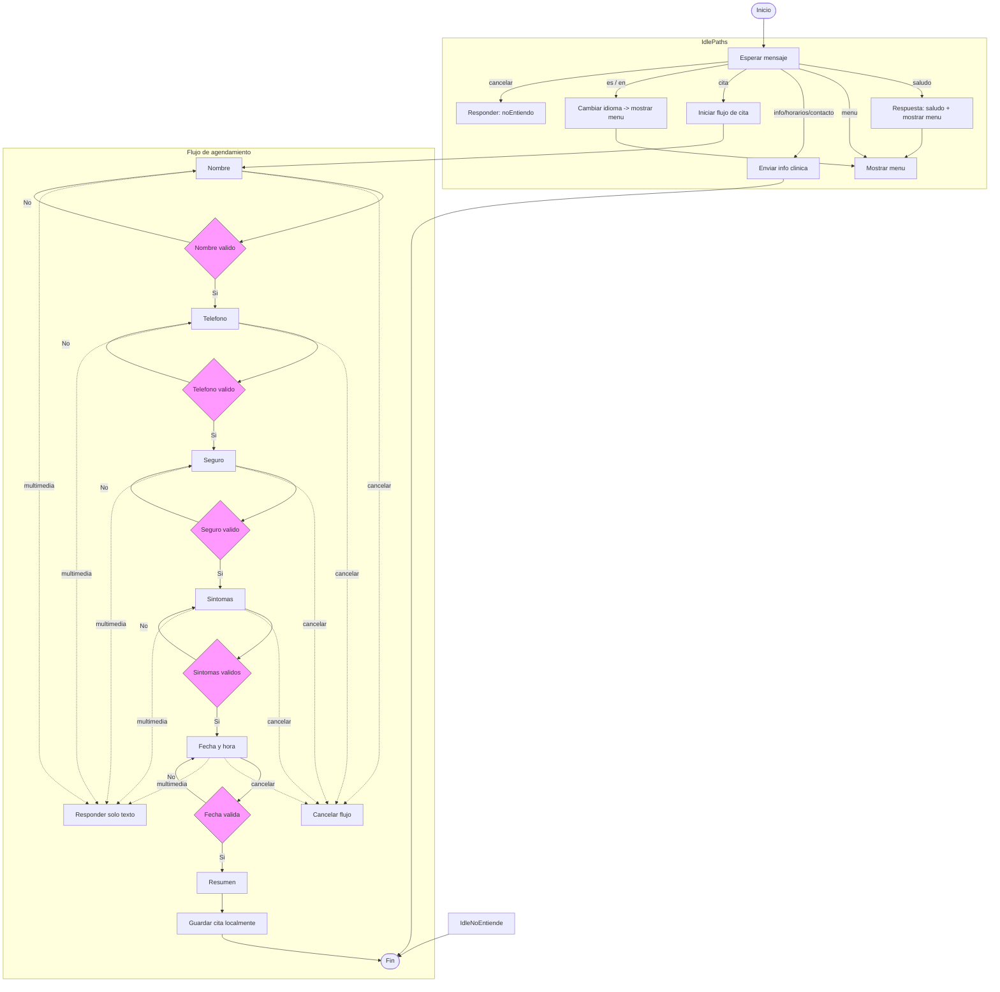

# Diagrama de flujo Q/A — Bot Abril

Este diagrama muestra el flujo de preguntas y respuestas del bot para el agendamiento de citas.

```mermaid
graph TD
  Start([Inicio]) --> Idle[Esperar mensaje]

  subgraph IdlePaths
    Idle -->|saludo| Saludo[Respuesta: saludo + mostrar menu]
    Idle -->|menu| Menu[Mostrar menu]
    Idle -->|info/horarios/contacto| Info[Enviar info clinica]
    Idle -->|cita| StartFlow[Iniciar flujo de cita]
    Idle -->|es / en| LangChange[Cambiar idioma -> mostrar menu]
    Idle -->|cancelar| IdleNoEntiendo[Responder: noEntiendo]
  end

  subgraph FlujoCita[Flujo de agendamiento]
    StartFlow --> AskName[Nombre]
    AskName --> ValidateName{Nombre valido}
    ValidateName -- Si --> AskPhone[Telefono]
    ValidateName -- No --> AskName

    AskPhone --> ValidatePhone{Telefono valido}
    ValidatePhone -- Si --> AskInsurance[Seguro]
    ValidatePhone -- No --> AskPhone

    AskInsurance --> ValidateInsurance{Seguro valido}
    ValidateInsurance -- Si --> AskSymptoms[Sintomas]
    ValidateInsurance -- No --> AskInsurance

    AskSymptoms --> ValidateSymptoms{Sintomas validos}
    ValidateSymptoms -- Si --> AskDate[Fecha y hora]
    ValidateSymptoms -- No --> AskSymptoms

    AskDate --> ValidateDate{Fecha valida}
    ValidateDate -- No --> AskDate
    ValidateDate -- Si --> Summary[Resumen]

    Summary --> Save[Guardar cita localmente]
    Save --> End([Fin])

    %% Cancel y multimedia durante flujo
    AskName -.->|cancelar| CancelFlow[Cancelar flujo]
    AskPhone -.->|cancelar| CancelFlow
    AskInsurance -.->|cancelar| CancelFlow
    AskSymptoms -.->|cancelar| CancelFlow
    AskDate -.->|cancelar| CancelFlow

    AskName -.->|multimedia| OnlyText[Responder solo texto]
    AskPhone -.->|multimedia| OnlyText
    AskInsurance -.->|multimedia| OnlyText
    AskSymptoms -.->|multimedia| OnlyText
    AskDate -.->|multimedia| OnlyText
  end

  LangChange --> Menu
  Saludo --> Menu
  Info --> End
  IdleNoEntiende --> End

  classDef decision fill:#f9f,stroke:#333,stroke-width:1px;
  class ValidateName,ValidatePhone,ValidateInsurance,ValidateSymptoms,ValidateDate decision;
```

